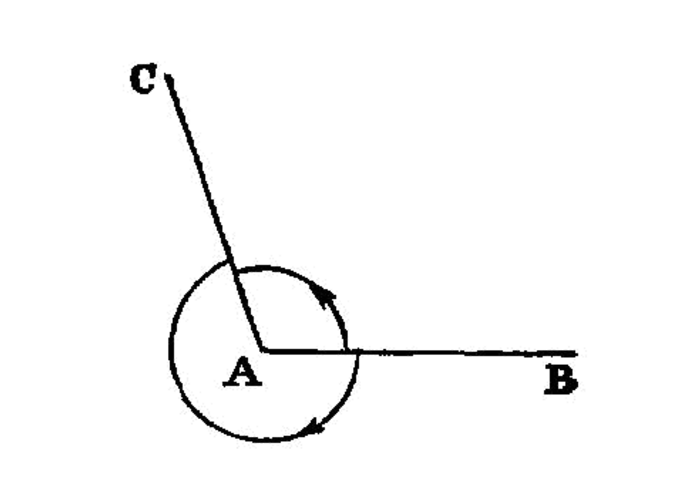

Right (Perpendicular) Angle
===========================

.. index:: angles

When a straight line set up on a straight line makes the adjacent angles equal to one another, each of the equal angles is *right*, and the straight line standing on the other is called a *perpendicular* to that on which it stands.

===