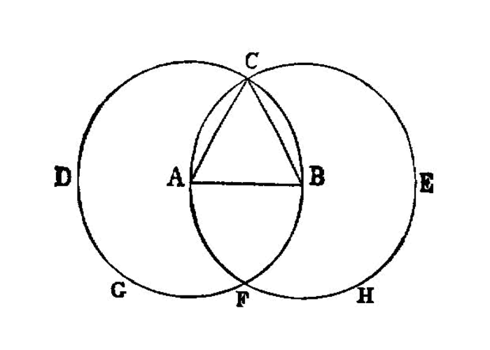

.. _I.1:
.. _construct equilateral triangle:

construct an equilateral triangle on a segment
==============================================

.. index:: construction, triangles, segments

..

  On a given finite straight line to construct an equilateral triangle.

  -- Euclid

From the given points :math:`A` and :math:`B` construct :ref:`segment`
:math:`\overline{AB}`.

**PROBLEM:** construct an :ref:`equilateral triangle` on the :ref:`segment` 
:math:`\overline{AB}`. 

:ref:`Construct circle <construct a circle>` :math:`(A, B)` as :math:`c_1`

:ref:`Construct circle <construct a circle>` :math:`(B, A)` as :math:`c_2`

.. todo:: define intersection point

Identify the two intersection points of circles :math:`c_1` and :math:`c_2`
as points :math:`C` and :math:`D`

From the points :math:`A` and :math:`C` construct :ref:`segment`
:math:`\overline{AC}`.

From the points :math:`B` and :math:`C` construct :ref:`segment`
:math:`\overline{BC}`.

As the :ref:`circle` is defined, all points on the perimeter are an equal distance from the center.

Now, since the point :math:`A` is the centre of the circle :math:`c_1`
And point :math:`B` and :math:`C` are on the perimeter of circle :math:`c_1`

- segment :math:`\overline{AC}` is equal to :math:`\overline{AB}`

And, since the point :math:`B` is the centre of the circle :math:`c_2`
And point :math:`A` and :math:`C` are on the perimeter of circle :math:`c_2`

- segment :math:`\overline{BC}` is equal to :math:`\overline{AB}`

But **CA** was also proved equal to **AB**; therefore each of the straight lines
**CA**, **CB** is equal to **AB**.

And things which are equal to the same thing are also equal to one another;
:ref:`01.cn.01`

- therefore **CA** is also equal to **CB**.

Therefore the three straight lines **CA**, **AB**, **BC** are equal to one
another. [5]_

Therefore the triangle **ABC** is equilateral; and it has been constructed on the
given finite straight line **AB**.

- (Being) what it was required to do.

dependencies
------------

[I.def.15]: /elem.1.def.15 "Book I - Definition 15"
[I.post.1]: /elem.1.post.1 "Book I - Postulate 1"
[I.post.3]: /elem.1.post.3 "Book I - Postulate 3"
[I.c.n.1]: /elem.1.c.n.1 "Book I - Common Notion 1"

.. [references]
.. graph BT

.. I_1[ I.1 ]:::post;

.. %%%% I_1 dependencies

.. I_post1( I.post.1 ):::post;
.. click I_post1 "/elem.1.post.1" "Book I Postulate 1";

.. I_post3( I.post.3 ):::post
.. click I_post3 "/elem.1.post.3" "Book I Postulate 3";

.. I_def15( I.def.15 ):::def
.. click I_def15 "/elem.1.def.15" "Book I Definition 15";

.. I_cn1( I.c.n.1 ):::cn
.. click I_cn1 "/elem.1.c.n.1" "Book I Common Notion 1";

.. %%%% I_1 links

.. I_1 --> I_post1
.. I_1 --> I_post3
.. I_1 --> I_def15
.. I_1 --> I_cn1

.. [/references]

footnotes
---------

.. .. [1] On a given finite straight line

    .. The Greek usage differs from ours in that the definite article is employed
    .. in such a phrase as this where we have the indefinite. <foreign
    .. lang="greek">ἐπὶ τῆς δοθείσης εὐθείας πεπερασμένης</foreign>, <quote>on
    .. <em>the</em> given finite straight line,</quote> i.e. the finite straight
    .. line which we choose to take.

.. [2] Let **AB** be the given finite straight line.

    To be strictly literal we should have to translate in the reverse order
    <quote>let the given finite straight line be the (straight line)
    **AB** </quote> ; but this order is inconvenient in other cases where there
    is more than one datum, e.g. in the <em>setting-out</em> of <a
    href="/elem.1.2">I. 2</a>, <quote>let the given point be **A**, and the
    given straight line **BC**,</quote> the awkwardness arising from the
    omission of the verb in the second clause. Hence I have, for clearness'
    sake, adopted the other order throughout the book.

.. [3] let the circle **BCD** be described.

    Two things are here to be quoted, 

    1. the elegant and practically universal use of the perfect passive
       imperative in constructions, <foreign
       lang="greek">γεγράφθω</foreign> meaning of course <quote>let it
       <em>have been</em> described</quote> or <quote>suppose it
       described,</quote>

    2. the impossibility of expressing shortly in a translation the force of
       the words in their original order. <foreign lang="greek">κύκλος
       γεγράφθω ὸ ΒΓΔ</foreign> means literally <quote>let a circle have
       been described, the (circle, namely, which I dequote by)
       **BCD**.</quote> Similarly we have lower down <quote>let straight
       lines, (namely) the (straight lines) **CA**, **CB**, be
       joined,</quote> <foreign lang="greek">ἐπεζεύχθωσαν εὐθεῖαι αί ΓΑ,
       ΓΒ</foreign>. There seems to be no practicable alternative, in
       English, but to translate as I have done in the text.

.. [4] from the point **C**

    Euclid is careful to adhere to the phraseology of <a
    href="/elem.1.post.1">Postulate 1</a> except that he speaks of
    <quote>joining</quote> (<foreign lang="greek">ἐπεζεύχθωσαν</foreign>)
    instead of <quote>drawing</quote> (<foreign
    lang="greek">γράφειν</foreign>). He does not allow himself to use the
    shortened expression <quote>let the straight line **FC** be joined</quote>
    (without mention of the points **F**, **C**) until <a href="/elem.1.5">I.
    5</a>.

.. [5] each of the straight lines **CA**, **CB**,

    <foreign lang="greek">ἑκατέρα τῶν ΓΑ, ΓΒ</foreign> and 24. the three straight lines **CA**, **AB**, **BC**,
    <foreign lang="greek">αἱ τρεῖς αἱ ΓΑ, ΑΒ, ΒΓ</foreign>. I have, here and in
    all similar expressions, inserted the words <quote>straight lines</quote>
    which are not in the Greek. The possession of the inflected definite
    article enables the Greek to omit the words, but this is not possible in
    English, and it would scarcely be English to write <quote>each of **CA**,
    **CB** </quote> or <quote>the three **CA**, **AB**, **BC**.</quote>
