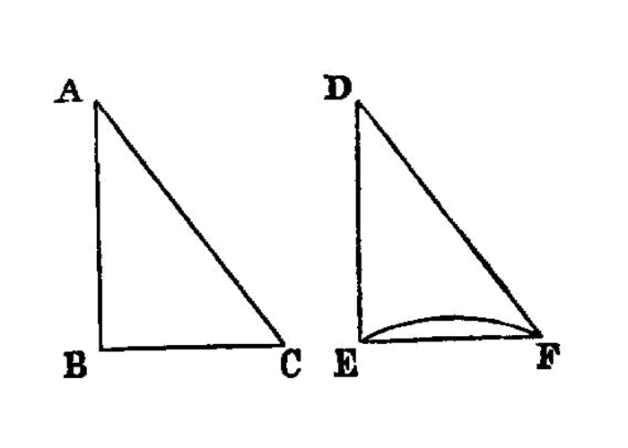

.. _I.4:
.. _triangles with equal sides have equal angles:

triangles with equal sides have equal angles
============================================

.. index:: proof, triangles

..

  I.4

  If two triangles have the two sides equal to two sides respectively, and have
  the angles contained by the equal straight lines equal, they will also have
  the base equal to the base, the triangle will be equal to the
  triangle, and the remaining angles will be equal to the remaining
  angles respectively, namely those which the equal sides subtend.
  

  -- Euclid

Let **ABC**, **DEF** be two triangles having the two sides **AB**, **AC** equal
to the two sides **DE**, **DF** respectively, namely **AB** to **DE** and
**AC** to **DF**, and the angle **BAC** equal to the angle **EDF**.

I say that the base **BC** is also equal to the base **EF**, the triangle
**ABC** will be equal to the triangle **DEF**, and the remaining angles will be
equal to the remaining angles respectively, namely those which the equal sides
subtend, that is, the angle **ABC** to the angle **DEF**, and the angle **ACB**
to the angle **DFE**.

For, if the triangle **ABC** be applied to the triangle **DEF**,

- and if the point **A** be placed on the point **D** and the straight line
  **AB** on **DE**,

then the point **B** will also coincide with **E**, because **AB** is
equal to **DE**.

Again, **AB** coinciding with **DE**, the straight line **AC** will also
coincide with **DF**, because the angle **BAC** is equal to the angle **EDF**;

- hence the point **C** will also coincide with the point **F**, because **AC**
  is again equal to **DF**.

But **B** also coincided with **E**; hence the base **BC** will coincide with
the base **EF**.

[For if, when **B** coincides with **E** and **C** with **F**, the base **BC**
does not coincide with the base **EF**, two straight lines will enclose a
space: which is impossible.

- Therefore the base **BC** will coincide with **EF**] and will be
  equal to it. [I.c.n.4]

Thus the whole triangle **ABC** will coincide with the whole triangle **DEF**,

- and will be equal to it.

And the remaining angles will also coincide with the remaining angles and will
be equal to them, the angle **ABC** to the angle **DEF**, and the angle **ACB**
to the angle **DFE**.

Therefore etc. 

- (Being) what it was required to prove.

[I.c.n.4]: /elem.1.c.n.4 "Book 1 - Common Notion 4"

dependencies
----------

.. graph BT

.. I_4[ I.4 ]:::prop;
.. click I_4 "/elem.1.4" "Book I Proposition 4";

.. %%%% dependencies

.. I_cn4( I.cn.4 ):::cn;
.. click I_cn4 "/elem.1.c.n.4" "Book I Common Notion 4";

.. %%%% links

.. I_4 --> I_cn4

